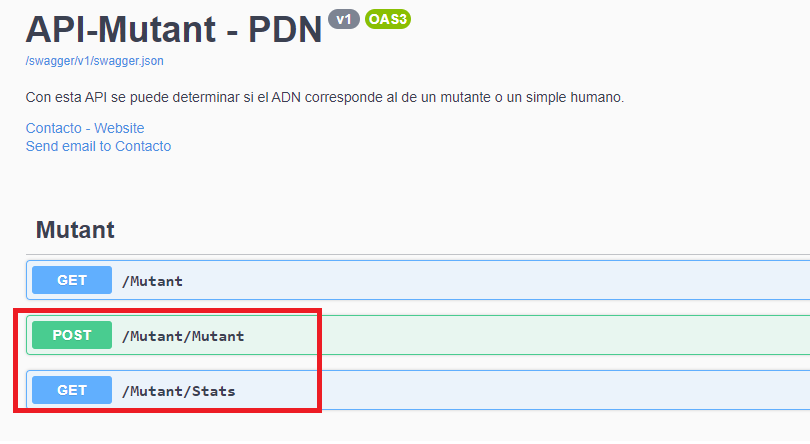

# Analizador de ADN mutante
#### Prueba Mercado Libre - Desarrollador Backend
El objetivo de este aplicativo es: 
* Analizar la secuencia de ADN de un individuo, y determinar si corresponde a la de un mutante o a la de un humano
* Estadistica Mutantes Vs Humanos
***

### Tecnologias y herramientas
* ASP.Net Core
* Swagger
* Entityframework Core
### Provedor de nube: Azure 
* Base de dartos: Azure SQLServer
* Servidor: Azure App Service
* Application insights
* Key Vault

## Swagger
Para acceder a la Interface de swagger pude ingresar al siguiente link [https://mutantapp.azurewebsites.net/swagger](https://mutantapp.azurewebsites.net/swagger). Desde este portal, podra acceder a los servicios que se encuentran disponibles en el aplicativo. 

 
 #### Servicio Mutant
 * Descripcion del servicio
 Permite  analizar una secuencia de ADN, si se encuentra una secuencia de cuatro letras iguales, de forma oblicua, horizontal o vertical se considera el individuo un mutante. 
 El resultado de cada analisis el almacenado en base de datos.
 - URL Post
 [https://mutantapp.azurewebsites.net/mutant/Mutant](https://mutantapp.azurewebsites.net/mutant/Mutant)

* CONTRATO  

|**Propiedad**|**Obligatorio**|**Descripcion**
| :-: | :-: | :-: | 
|dna|si|secuencia de adn a validar, ejemplo ["ATGCGA","CAGTGC","TTATGT","AGAAGG","CCCCTA","TCACTG"]|

Json Entrada

    {
        "dna": ["ATGCGA","CAGTGC","TTATGT","AGAAGG","CCCCTA","TCACTG"]
    }

* RESPUESTA

|**status**|**message**
| :-: | :-: |
|200|Felicidades, es un Mutante |
|403|Lo sentimos, es un Humano |

***
 #### Servicio Stasts
 * Descripcion del servicio
 Retorna la cantidad de Mutantes y humanos que han sido analizado en la aplicacion.
 - URL Get
 [https://mutantapp.azurewebsites.net/mutant/Stats](https://mutantapp.azurewebsites.net/mutant/Stats)

* RESPUESTA

|**status**|**message**
| :-: | :-: |
|countMutantDna | nuemro de mutantes confirmados |
|countHumanDna | Numero de humanos confirmados|
|ratio | Relacion Mutantes vs Humanos|
Json Respuesta

    {
    "countMutantDna": 13,
    "countHumanDna": 14,
    "ratio": 0.9285714
    }

***

## Pruebas unitarias 
Para garantizar la calidad del codigo se han implementado pruebas unitarias, las cuales cubren todos los escenarios de negocio del aplicativo. 
A continuacion se relacionan las pruebas unitarias 
* Mutant_is_true()
* Mutant_is_false()
* Stats()
* NitrogenBase_is_true()
* NitrogenBase_is_false()
* HorizontalSequenceSearch_is_true()
* HorizontalSequenceSearch_is_false()
* VerticalSequenceSearch_is_true()
* VerticalSequenceSearch_is_false()
* ObliqueSequenceSearch_is_true()
* ObliqueSequenceSearch_is_false()
* MatrixNxN_is_true()
* MatrixNxN_is_false()
* GenerateMatrix()
* GetEnumDescription()